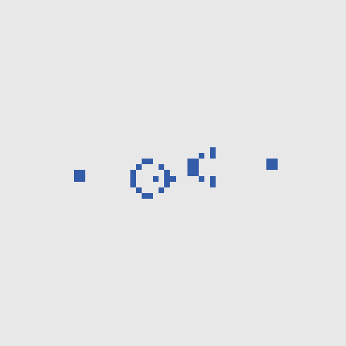
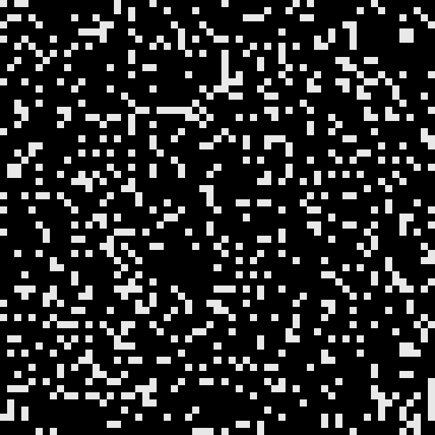
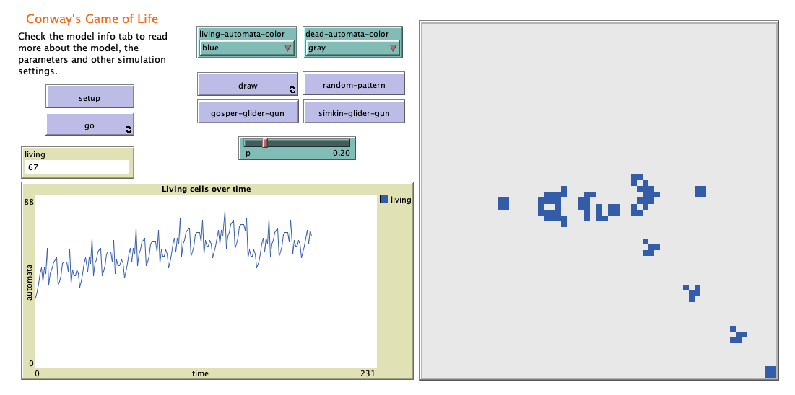

# Cellular Automata

Different cellular automata implemented in NetLogo.

1. [Conway's Game of Life](https://en.wikipedia.org/wiki/Conway%27s_Game_of_Life)
2. [Langton's ant](https://en.wikipedia.org/wiki/Langton%27s_ant)
3. [Brian's brain](https://en.wikipedia.org/wiki/Brian%27s_Brain)
4. [Rule 110](https://en.wikipedia.org/wiki/Rule_110)
5. [Rule 30](https://en.wikipedia.org/wiki/Rule_30)
6. [Rule 90](https://en.wikipedia.org/wiki/Rule_90)

    
    
    

    
    
    

## Usage

Load the model in NetLogo and press `setup`to load the world. Draw a pattern or select one of the availables. Press the button `go` to start the simulation. For more information, check the `Info` tab in NetLogo.

    

Models have been tested in NetLogo 6.1.1.

